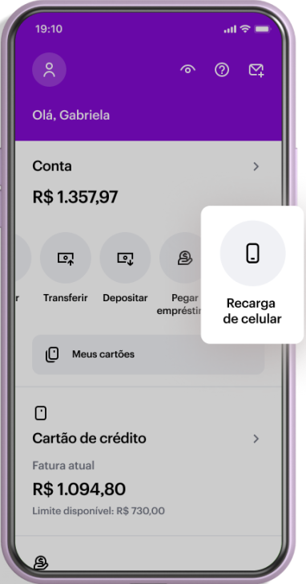
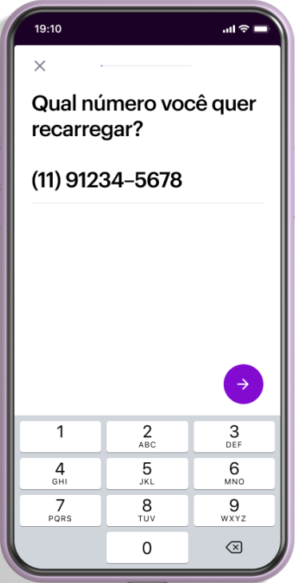
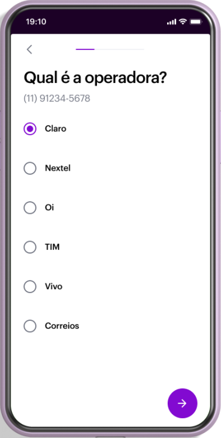
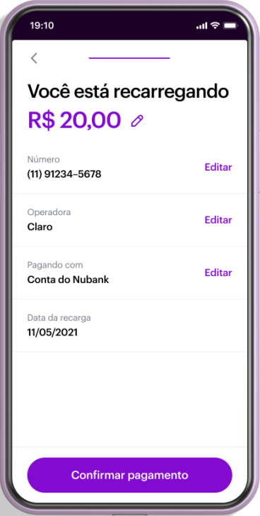

# Fazer recarga no aplicativo Nubank

1. Abra o app do Nubank.

2. Faça o login com agência e conta. A tela inicial é exibida.

3. Clique em **Recarga de celular**.

 

4. Informe o número do celular que deseja carregar, incluindo o DDD. Depois, clique na seta para avançar.

 

5. Selecione a operadora do celular e clique na seta para avançar.

 

6. Confira as informações da recarga. Se estiverem corretas, clique em **Confirmar pagamento**.

